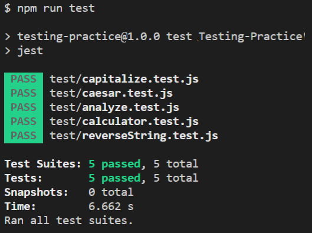

# Testing Practice

[![Contributors][contributors-shield]][contributors-url]
[![Forks][forks-shield]][forks-url]
[![Stargazers][stars-shield]][stars-url]
[![Issues][issues-shield]][issues-url]

In this project, we are building Unit Testing that test several different functions with TDD (Jest). Test Driven Development(TDD) with Jest. There are many test-running systems available in JavaScript: Mocha, Jasmine, Tape and Jest.

### Screenshot



## Built With

- JavaScript
- NPM
- Jest

## Usage
- Clone the repo and move into the project directory
- Run "npm install"
- Run "npm run test"

## Getting Started

To get started with the app, cd to the directory where you would like the repo to live by typing on your terminal:

Clone the repo typing:

```
$git clone https://github.com/shubham14p3/Testing-Practice.git
```

## Authors

👤 **Cyrus Kiprop**

- Github: [Cyrus-Kiprop](https://github.com/Cyrus-Kiprop)
- Twitter: [@kipropJS](https://twitter.com/kipropJS)
- Linkedin: [Cyrus Kiprop](https://www.linkedin.com/in/cyrus-kiprop-ba7320120/)

👤 **Shubham Raj**

- Github: [@ShubhamRaj](https://github.com/shubham14p3)
- Linkedin: [Shubham14p3](https://www.linkedin.com/in/shubham14p3/)

## 🤝 Contributing

Contributions, issues and feature requests are welcome!

Feel free to check the [issues page](https://github.com/shubham14p3/Testing-Practice/issues/).

## Show your support

Give a ⭐️ if you like this project!

## Acknowledgments

- Project requested by [Microverse Program](https://www.microverse.org/).

## Future Enhancement 

- Adding More Unit Testing.

<!-- MARKDOWN LINKS & IMAGES -->

[contributors-shield]: https://img.shields.io/github/contributors/shubham14p3/Testing-Practice.svg?style=flat-square
[contributors-url]: https://github.com/shubham14p3/Testing-Practice/graphs/contributors
[forks-shield]: https://img.shields.io/github/forks/shubham14p3/Testing-Practice.svg?style=flat-square
[forks-url]: https://github.com/shubham14p3/Testing-Practice/network/members
[stars-shield]: https://img.shields.io/github/stars/shubham14p3/Testing-Practice.svg?style=flat-square
[stars-url]: https://github.com/shubham14p3/Testing-Practice/stargazers
[issues-shield]: https://img.shields.io/github/issues/shubham14p3/Testing-Practice.svg?style=flat-square
[issues-url]: https://github.com/shubham14p3/Testing-Practice/issues
